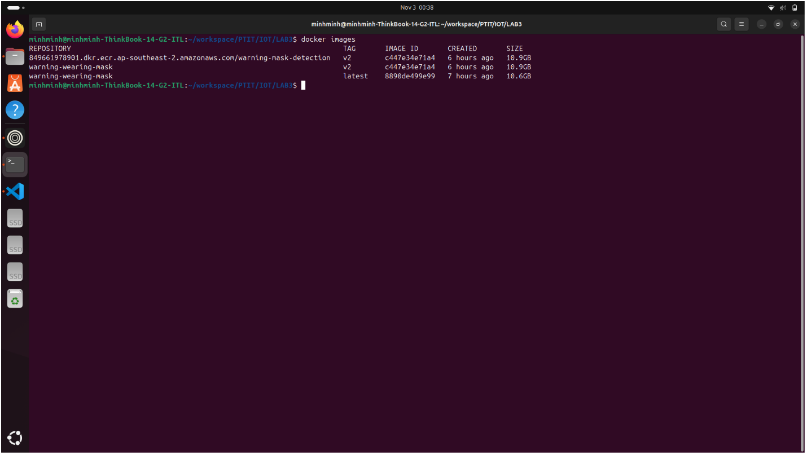
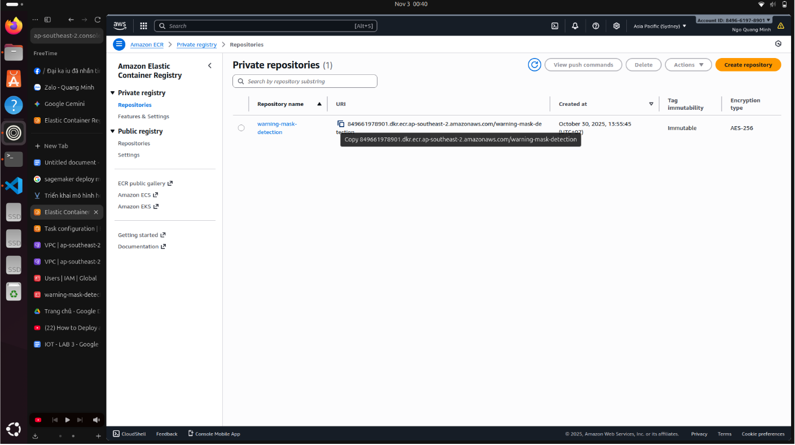
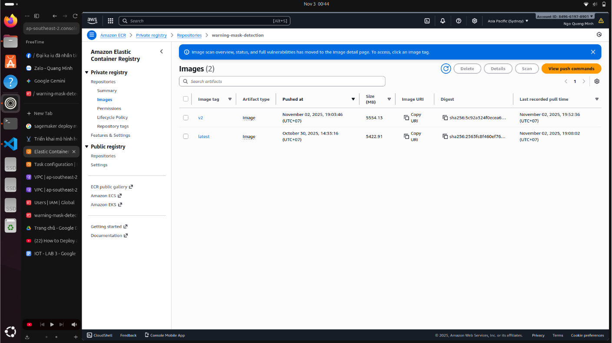
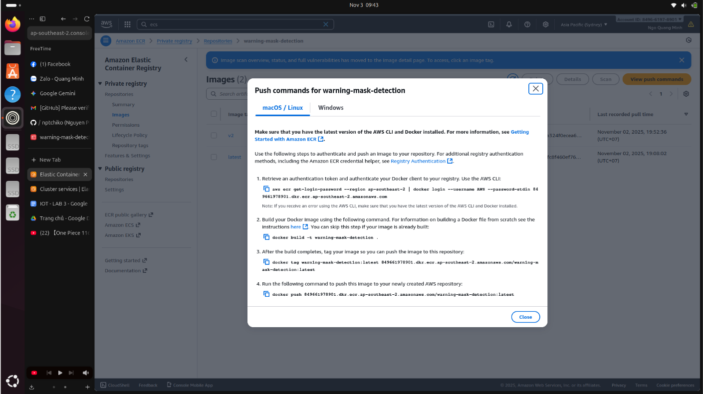
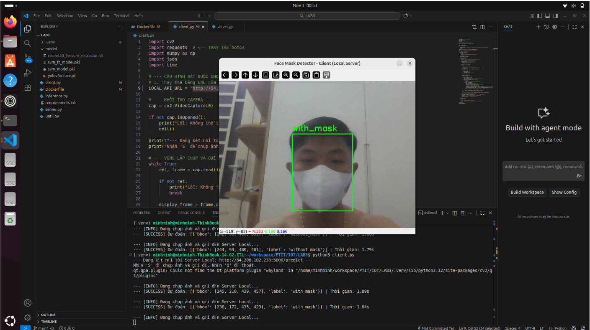
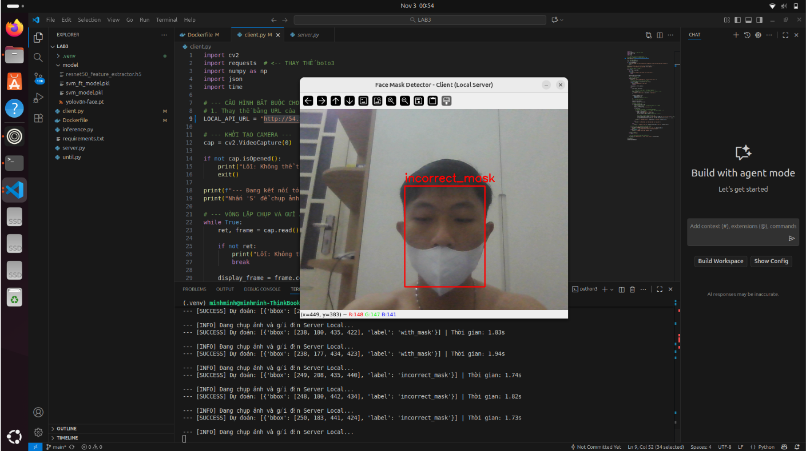
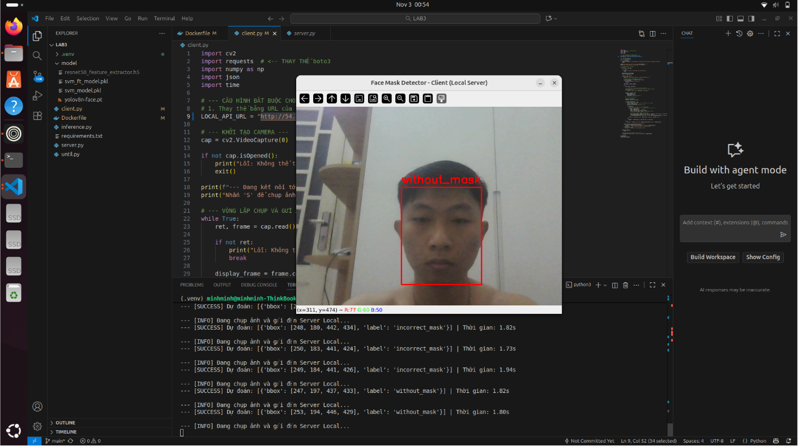

# aws-deploy-ml-model
🚀 Triển Khai Mô Hình Machine Learning với AWS ECS Fargate
BÁO CÁO: IOT - LAB 3

Đây là tài liệu tóm tắt về kiến trúc và quy trình triển khai (deployment) một mô hình Machine Learning (phát hiện khẩu trang) thành một dịch vụ API có khả năng mở rộng, ổn định sử dụng các công nghệ hiện đại.

Tác giả: Ngô Quang Minh (N22DCCN053) & Nguyễn Khắc Tùng Dương (N22DCCN018)
1. 💡 Kiến Trúc Tổng Quan

Kiến trúc này tận dụng tính "serverless" của AWS Fargate để chạy các ứng dụng được đóng gói bằng Docker, giúp đơn giản hóa việc vận hành và quản lý cơ sở hạ tầng.
Công nghệ	Vai trò Chính
Docker	Đóng gói ứng dụng Flask/Python và mô hình ML vào một Container Image duy nhất.
Amazon ECR	Kho lưu trữ riêng tư cho Docker Image, đảm bảo an toàn và tích hợp chặt chẽ với AWS.
Amazon ECS (Fargate)	Dịch vụ điều phối Container (Container Orchestration) ở chế độ Serverless, tự động khởi chạy và duy trì các tác vụ (Tasks) từ Image ECR.
Client	Truy cập dịch vụ thông qua Public IP hoặc Load Balancer.
2. ⚙️ Quy Trình Triển Khai Chi Tiết

Quy trình được chia thành các giai đoạn chính: Đóng gói, Lưu trữ và Vận hành.
2.1. Bước 1: Docker hóa Ứng dụng ML

Ứng dụng Python (sử dụng Flask/Gunicorn) và các mô hình ML (như resnet50_feature_extractor.h5, yolov8n-face.pt) được đóng gói để tạo thành môi trường thực thi độc lập.

Lưu ý quan trọng: Báo cáo khuyến nghị sử dụng máy chủ WSGI (như Gunicorn) thay vì máy chủ phát triển (dev server) của Flask để đảm bảo an toàn và hiệu suất trong môi trường Production.

    Cấu trúc thư mục cốt lõi:

    /LAB3
    |-- /model/
    |-- client.py
    |-- Dockerfile
    |-- inference.py
    |-- requirements.txt
    |-- server.py (Máy chủ API Flask/Gunicorn)

2.2. Bước 2: Đẩy Image lên Amazon ECR

Image Docker được xây dựng trên máy cục bộ, gắn thẻ (tag) theo định dạng ECR và sau đó được đẩy (push) lên Repository đã tạo.

    Tạo Repository: Tạo kho lưu trữ (ví dụ: warning-mask-detection) trên AWS ECR.

    Xác thực Docker: Thực hiện xác thực để cấp quyền cho Docker CLI đẩy image lên ECR bằng AWS CLI.

    Build & Push:

        docker build -t warning-wearing-mask:v2 .

        docker tag ... (Gắn thẻ theo URI ECR)

        docker push ... (Đẩy lên ECR)

2.3. Bước 3: Vận hành Dịch vụ trên Amazon ECS (Fargate)

Các bước cấu hình ECS để sử dụng Image từ ECR và khởi chạy dịch vụ:

    Tạo ECS Cluster: Sử dụng chế độ "Networking only" để kích hoạt Fargate.

    Tạo Task Definition (Bản thiết kế):

        Chọn Fargate làm launch type.

        Cấu hình Task Size (Ví dụ: 1 vCPU, 4GB Memory) phù hợp với yêu cầu của mô hình ML.

        Container Definitions: Dán URI Image ECR và cấu hình Port Mapping (Container Port: 5000).

    Tạo Service (Duy trì):

        Chọn Task Definition vừa tạo, đặt Desired tasks: 1.

        Networking:

            Security Groups: Mở cổng 5000 (Custom TCP) cho nguồn 0.0.0.0/0 (Internet).

            Auto-assign public IP: BẮT BUỘC phải đặt thành ENABLED để có thể truy cập từ bên ngoài.

3. 🛡️ Khắc Phục Sự Cố (Troubleshooting)

Vấn đề phổ biến nhất là "Không thể truy cập URL" thường liên quan đến Network:

    Security Group: Đảm bảo Inbound Rule của Security Group cho phép truy cập qua Cổng 5000 (hoặc cổng mà container đang chạy).

    Public IP: Phải bật "Auto-assign public IP" khi tạo Service để Task có địa chỉ IP công cộng.

    Port Mapping: Đảm bảo Container port trong Task Definition khớp với cổng mà ứng dụng (Flask/Gunicorn) đang lắng nghe (mặc định là 5000).

4. 🌐 DEMO Truy Cập Dịch Vụ

Dịch vụ đã được triển khai thành công và có thể được truy cập thông qua địa chỉ IP công cộng.

Địa chỉ IP công cộng máy chủ Demo: http://54.206.102.233:5000/predict

(Phần báo cáo bao gồm các ảnh chụp màn hình minh họa quá trình phát hiện khẩu trang từ máy khách đến dịch vụ đã triển khai.)
Kết quả Phát hiện	Tình trạng
Image of Mask Detection: With Mask	Đeo khẩu trang đúng cách.

Image of Mask Detection: Incorrect Mask	Đeo khẩu trang sai cách.

Image of Mask Detection: No Mask	Không đeo khẩu trang.
